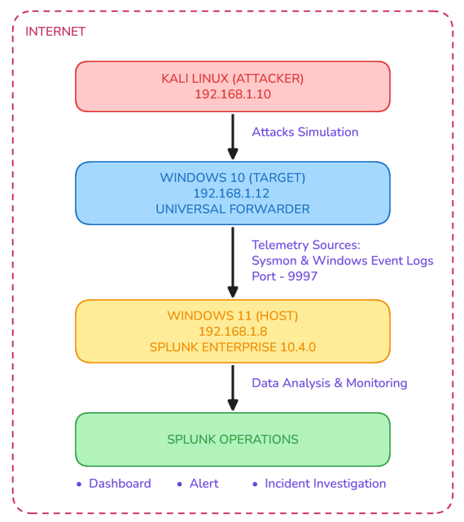
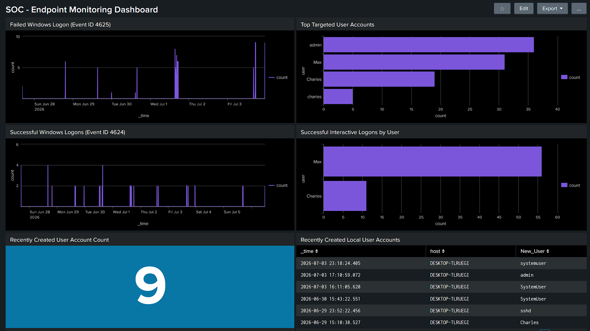
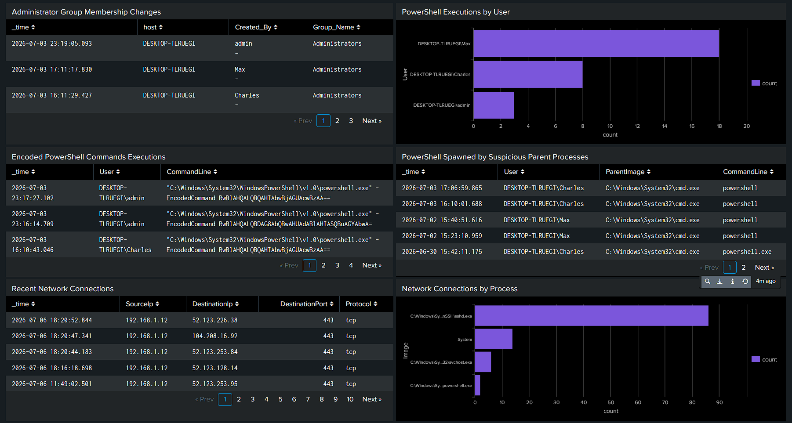
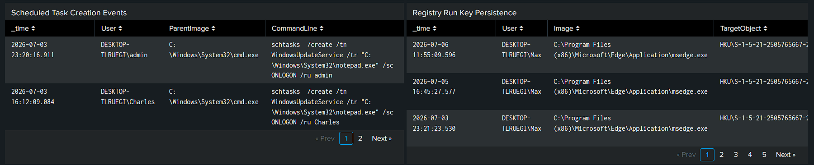
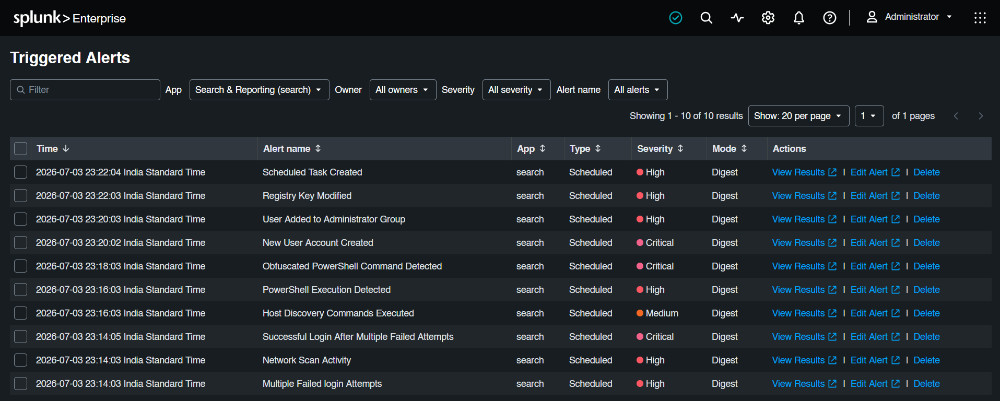
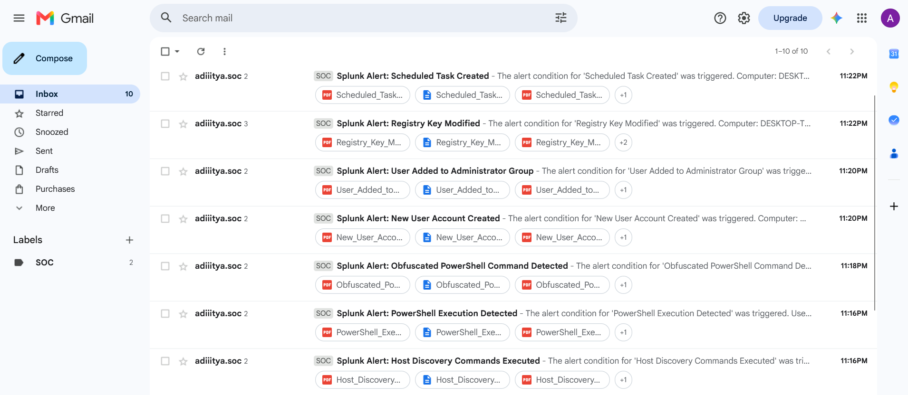
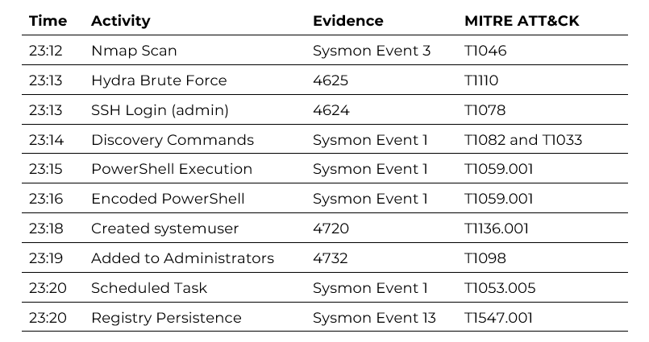

# Splunk SIEM Windows Endpoint Detection Lab

## Overview

This project demonstrates the implementation of a Security Information and Event Management (SIEM) solution using Splunk Enterprise to monitor, detect, and investigate common Windows attack techniques.

A Windows 10 endpoint was configured to forward Security and Sysmon logs to Splunk Enterprise. Various attack simulations were performed from a Kali Linux machine to validate custom detection rules, dashboards, and alerting capabilities.

The project follows a simplified SOC workflow consisting of log collection, detection engineering, attack simulation, alert generation, and incident investigation.

---

## Objectives

- Deploy a Splunk Enterprise SIEM lab
- Collect Windows Security and Sysmon logs
- Develop custom SPL detection queries
- Create SOC monitoring dashboards
- Configure automated email alerts
- Simulate attacker behavior
- Validate detections using Windows event logs

---

## Lab Environment

| Component | Details |
|----------|---------|
| SIEM | Splunk Enterprise 10.4.0 |
| Endpoint | Windows 10 |
| Attacker Machine | Kali Linux |
| Log Collector | Splunk Universal Forwarder |
| Virtualization | VMware Workstation |

---

## Tools & Technologies

- Splunk Enterprise
- Splunk Universal Forwarder
- Sysmon
- Windows Event Logs
- Kali Linux
- Nmap
- Hydra
- PowerShell
- Windows Command Prompt

---

## Attack Simulations

The following attacker activities were simulated to generate security events:

- Network Port Scan (Nmap)
- SSH Brute Force Attack (Hydra)
- Successful User Login after multiple failed logons
- Host/User Discovery Commands
- PowerShell Execution
- Encoded PowerShell Commands Execution
- Local User Account Creation
- User Added to Administrators Group
- Scheduled Task Persistence
- Registry Modification

---

## Detection Use Cases

Custom SPL queries were developed to detect:

- Failed Login Attempts
- Successful Logins
- Brute Force Activity
- PowerShell Execution
- Encoded PowerShell
- New User Creation
- Privilege Escalation
- Scheduled Task Creation
- Registry Persistence

---

## Dashboards

The project includes custom dashboard for:

- Windows Authentication Activity
- Failed Login Trends
- Top Targeted User Accounts
- Security Event Timeline
- PowerShell Monitoring
- Privilege Escalation Events
- Network Scanning Activity
- Scheduled Task Creation Events
- Registry Key Modification Events

---

## Alerting

Automated alerts were configured to notify analysts when:

- Network scanning activity is identified
- Multiple failed logins exceed the configured threshold
- Sucessful login after multiple failed logon attempts
- Host/User Discovery commands detected
- PowerShell execution is detected
- Encoded powershell commands detected
- A new local user account is created
- Administrative privileges are assigned
- New Scheduled task is created
- Registey Changes is detected


---

## MITRE ATT&CK Mapping

| Technique | ATT&CK ID |
|-----------|-----------|
| Network Service Discovery | T1046 |
| Brute Force | T1110 |
| Remote Login (SSH) | T1078 |
| Discovery Commands | T1082 and T1033 |
| Command and Scripting Interpreter (PowerShell) | T1059.001 |
| Create Account | T1136 |
| Account Manipulation | T1098 |
| Scheduled Task | T1053 |
| Registry Modification | T1112 |

---

## Project Structure

```
Splunk-SIEM-Windows-Endpoint-Detection-Lab/
│
├── README.md
├── Report/
│   └── Splunk_SIEM_Project_Report.pdf
│
├── Screenshots/
│   ├── architecture-diagram.png
│   ├── dashboard1.png
│   ├── dashboard2.png
│   ├── dashboard3.png
│   ├── gmail-alerts.png
│   ├── incident-timeline.png
│   └── splunk-alerts.png
│
├── SPL_Queries/
│   └── Detection_Queries.md
│
└── Documentation/
```

---

## Screenshots

### Lab Architecture

*(Insert architecture diagram here)*



---

### Splunk Security Dashboard





---

### Splunk Alerts



---

### Gmail Alerts



---

### Incident Timeline



---

## Results

The SIEM lab successfully collected Windows Security and Sysmon logs and detected multiple simulated attack techniques through custom SPL queries and dashboards.

The project demonstrates practical experience with:

- Log ingestion
- Detection engineering
- Windows security monitoring
- Threat detection
- Alert generation
- Basic incident investigation

---

## Documentation

The complete project report, including setup procedures, methodology, detection logic, screenshots, attack simulations, analysis, and conclusions, is available in:


---

## Skills Demonstrated

- SIEM Implementation
- Windows Security Monitoring
- Splunk Administration
- Detection Engineering
- Security Event Analysis
- Threat Detection
- Log Analysis
- Incident Response
- Windows Event Logging
- Sysmon
- MITRE ATT&CK Mapping

---

## Author

**Aditya Yadav**

Mechanical Engineer transitioning into Cybersecurity with hands-on experience in SIEM, Vulnerability Management, Cloud Security, and Security Operations.
